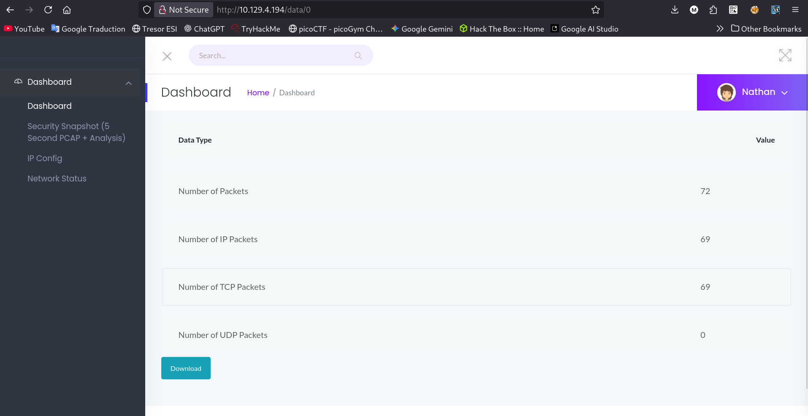
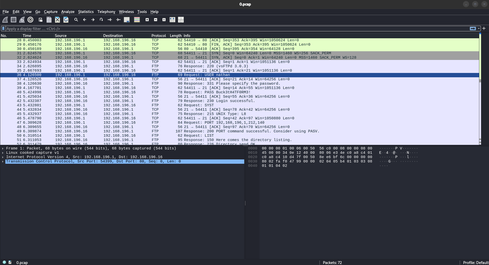
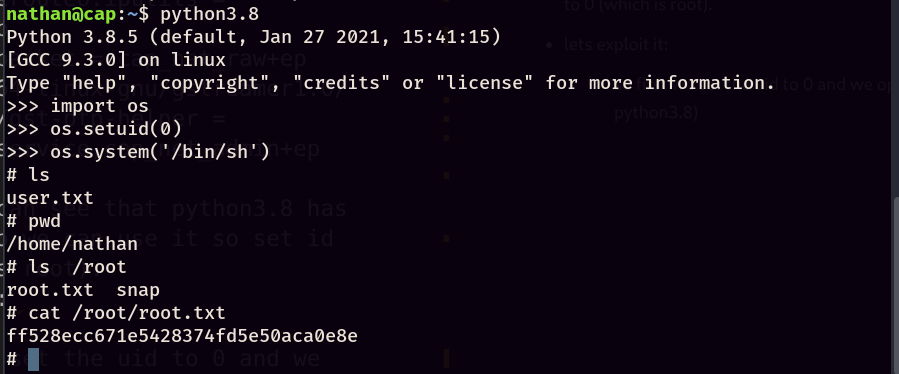

## Machine Information

**Machine name:** Cap (easy) \
**Machine IP:** 10.129.4.194

---

# My Walkthorugh:

---

* First we run an nmap scan :

```
❯ nmap -sC -sV 10.129.4.194
Starting Nmap 7.98 ( https://nmap.org ) at 2026-02-15 15:23 +0100
Nmap scan report for 10.129.4.194
Host is up (0.27s latency).
Not shown: 997 closed tcp ports (reset)
PORT   STATE SERVICE VERSION
21/tcp open  ftp     vsftpd 3.0.3
22/tcp open  ssh     OpenSSH 8.2p1 Ubuntu 4ubuntu0.2 (Ubuntu Linux; protocol 2.0)
| ssh-hostkey: 
|   3072 fa:80:a9:b2:ca:3b:88:69:a4:28:9e:39:0d:27:d5:75 (RSA)
|   256 96:d8:f8:e3:e8:f7:71:36:c5:49:d5:9d:b6:a4:c9:0c (ECDSA)
|_  256 3f:d0:ff:91:eb:3b:f6:e1:9f:2e:8d:de:b3:de:b2:18 (ED25519)
80/tcp open  http    Gunicorn
|_http-title: Security Dashboard
|_http-server-header: gunicorn
Service Info: OSs: Unix, Linux; CPE: cpe:/o:linux:linux_kernel

Service detection performed. Please report any incorrect results at https://nmap.org/submit/ .
Nmap done: 1 IP address (1 host up) scanned in 173.35 seconds
```

we can see 3 open tcp ports. (ssh + ftp + web)

---

* after running security snapshots we are redirected to /data/id

---

* task3 : Are you able to get to other users' scans?

i currently have [http://10.129.4.194/data/1](http://10.129.4.194/data/1) , maybe lets switch 1 with 2 or 3 , 2 works !
so the answer is yes

---

* task4 : What is the ID of the PCAP file that contains sensitive data?

since the current id 1 has nothing ineteresting, maybe 0 might be something related to an admin or atleast something interesting:



i see a bunch of stuff , lets download the pcap file and open it in wireshark:



we can see :

* USER nathan
* PASS Buck3tH4TF0RM3!

---

* Submit the flag located in the nathan user's home directory:

* lets connect with ssh:


we are in !

```
nathan@cap:~$ cat user.txt
cf846f62e44977fcfecf55d188349eaf
```

great !

---

* What is the full path to the binary on this machine has special capabilities that can be abused to obtain root privileges?

* so now we gotta do some privelege escalation:

lets do a basic getcap scan

```
nathan@cap:~$ getcap -r / 2>/dev/null
/usr/bin/python3.8 = cap_setuid,cap_net_bind_service+eip
/usr/bin/ping = cap_net_raw+ep
/usr/bin/traceroute6.iputils = cap_net_raw+ep
/usr/bin/mtr-packet = cap_net_raw+ep
/usr/lib/x86_64-linux-gnu/gstreamer1.0/gstreamer-1.0/gst-ptp-helper = cap_net_bind_service,cap_net_admin+ep
```

alright , we can see that python3.8 has cap_setuid, so we can use it so set id to 0 (which is root).

---

* lets exploit it:

* so first we set the uid to 0 and we open a shell again (using python3.8)



Done, we got the root flag !


My first ever machine, Done !
